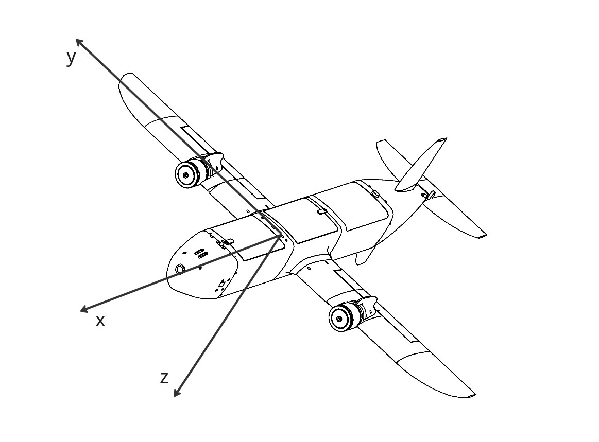

# Hackathon challenge: Online Video Stabilization

## Overview
This task is to build an online (preferably real-time) video stabilization method for UAV footage. We provide framed videos from three flight missions and corresponding sensor logs. The focus is on methods that do not rely on future frames at inference time.

## Setup
1. Request access to the dataset https://tytantechnologies-my.sharepoint.com/:u:/r/personal/daria_m_tytan-technologies_com/Documents/Hackaton_Oct25/data.zip?csf=1&web=1&e=96pdUg by emailing:
    - daria.m@tytan-technologies.com
    - jerge.moreno@tytan-technologies.com  
    In the email subject put your name, surname and email. You should receive access information in reply.
2. Extract the downloaded data and place it under the `data` directory in the project folder.
3. Install the dependencies: e.g. 
```
conda create -n tytan_hack python=3.10
conda activate tytan_hack
pip install -r requirements.txt
```
4. Test the dataloader and visualize data for debugging:
    - `python test.py`

You can also completely discard this repository and process the data however you like it:)

## Development
A baseline implementation is provided as `baseline.py`. It uses optical flow and relies only on image data. Feel free to develop your own stabilization algorithm. Note: online and real-time stabilization (no use of future frames) is much more valuable for this challenge.

## Data
- Framed videos for 3 flight missions are provided.
- Sensor data is provided in CSV files and is only partially synchronized — small time shifts may exist between video frames and sensor records.
- Matching between video frames and sensor data has been done to the best of our ability; improving synchronization can be part of your solution.
- A `raw` folder is included with more extensive logs and raw video files.
- No train / val / test split is provioded, you can decide how to use your data.

### Sensor fields
The sensor CSVs include the following fields:
- `ax_mDs2`: acceleration in the x-axis of the body frame, in m/s²  
- `ay_mDs2`: acceleration in the y-axis of the body frame, in m/s²  
- `az_mDs2`: acceleration in the z-axis of the body frame, in m/s²  
- `wx_radDs`: angular rate around the x-axis of the body frame, in rad/s  
- `wy_radDs`: angular rate around the y-axis of the body frame, in rad/s  
- `wz_radDs`: angular rate around the z-axis of the body frame, in rad/s  
- `q_OB = [qw, qx, qy, qz]^T`: components of the orientation quaternion (Hamilton convention)



## Notes
- Prefer online approaches that do not use future frames at inference.
- Synchronization between sensors and frames may require additional processing; this is a valid area for improvement.

- Use the provided baseline as a starting point or implement a new method as desired.

